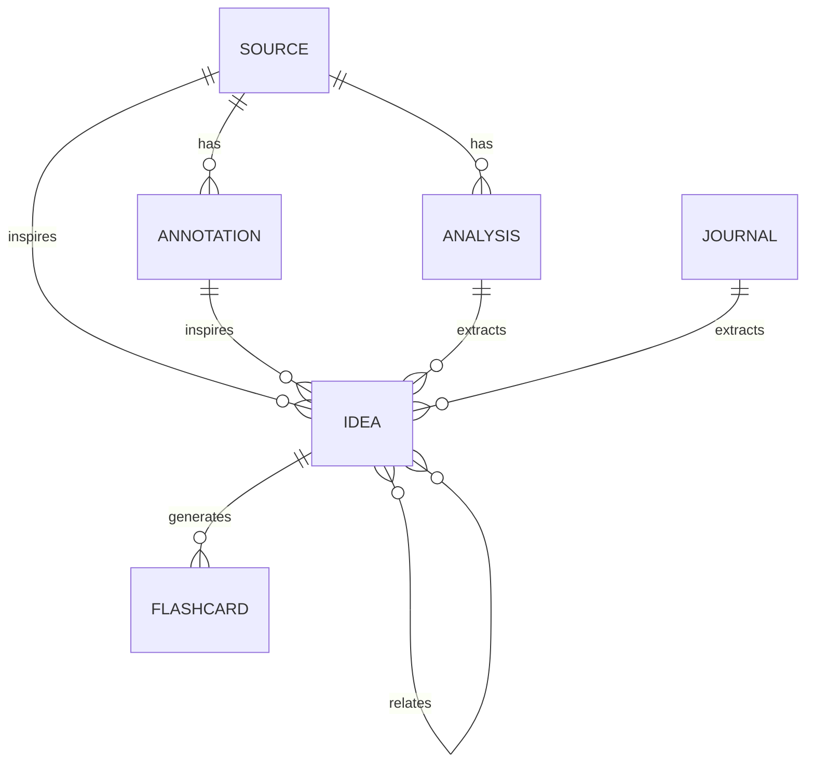

# 个人知识库架构蓝图

## 1. 目标

这套系统需要同时容纳以下活动：

- 快速保存网页链接、音视频 transcript 和 AI 对话。
- 保存外部原文，并将划线、简单批注和系统细读与原文分离。
- 形成短小原子观点，也允许逐步发展为较长论述。
- 建立稍后读、阅读中、已处理和失败重试等视图。
- 管理 PDF 学术文献及其引文信息。
- 从阅读与日常中提取英语学习材料，并通过 Yanki 同步到 Anki。
- 记录允许 AI 访问的日记和专题日志。
- 使用 Git 获取可审计、可回退的版本历史。

### 1.1 输入与输出全景

除内容类型、参与深度与生命周期三条轴线外，这套系统还可以从「输入 → 输出」的角度理解：输入被捕获、组织并长期保存，输出则把这些资产以不同形态重新交付给使用者。以下视图是对现有轴线的**补充**，不替代它们；每类输入仍由既有 `type`、目录与生命周期承载。

状态图例：**已支持** = 当前对象/目录可直接承载；**部分** = 由既有对象承载但能力不完整；**规划** = 明确列为未来候选，未在当前 schema/目录中激活。

| 输入 | 当前对象 / 目录 | 未来候选 | 状态 |
|---|---|---|---|
| 收集的网页文章，及音视频 transcript 与划线/批注 | `source`（`sources/web/`、`sources/transcripts/`）+ `annotation`（`notes/annotations/`） | — | 已支持 |
| 想法、灵感，及问答迭代 | `idea`（`notes/ideas/`） | 问答为候选 `type: idea` + `kind: QA`（一个问答一个 note，答案在 note 内迭代，仅成熟答案可日后抽成独立 Idea） | 部分 |
| 每日/时间/运动/睡眠记录 | `journal`（`journal/daily/`、`journal/logs/`） | 结构化生活指标与个人生活面板 | 部分 |
| 英语单词与例句 | `language_item`（`learning/english/candidates/`、`learning/anki/`） | — | 已支持 |
| 文献/PDF 与阅读笔记 | `source`（`sources/documents/`，Zotero 管理 PDF）+ `analysis`（`notes/analyses/`） | — | 已支持 |
| AI 对话 | `source`（`sources/conversations/`，标注未核实） | — | 已支持 |
| 引用的句子、完整诗作与格言 | — | 候选 Source 子类型 + 候选 `sources/excerpts/`；个人联想保留在 `annotation` | 规划 |

| 输出 | 当前载体 / 未来目的地 | 状态 |
|---|---|---|
| 直接阅读 Obsidian 笔记 | Obsidian Vault | 已支持 |
| 有依据的知识问答 | 未来只读问答 agent，答案引用 note ID/路径 | 规划 |
| 稍后读队列 | `reading.base` | 已支持 |
| 个人生活面板 | 未来仪表盘（结构化生活指标） | 规划 |
| Anki 卡片 | `flashcard` → Yanki → Anki | 已支持 |
| 周期性复习 | 未来定期复习流程 | 规划 |
| 成熟的 Essay / 写作 | `essay`（`notes/essays/`） | 已支持 |

**闭环设计**：输出可以成为新输入——例如一段知识问答的结论可回写为 `idea`/`essay` 并再次进入检索。因此，未来每一项**新输入**都必须声明它被哪些输出消费/呈现；每一项**新输出**都必须声明它的来源对象与所需字段。这避免「只收集不被消费」的仓库，也避免「没有数据支撑的面板/回答」。

## 2. 核心模型：三条互不混用的轴

### 2.1 内容类型 `type`

`type` 表达文件的身份：

| 值 | 含义 |
|---|---|
| `source` | 外部原始材料或来源索引 |
| `annotation` | 摘录、划线、局部批注 |
| `analysis` | 系统性细读、论证重构与评价 |
| `idea` | 原子化个人观点 |
| `essay` | 较长论述或综合文章 |
| `journal` | 日记和日常记录 |
| `language_item` | 英语等语言学习候选材料 |
| `flashcard` | Yanki 管理的正式卡片 |
| `map` | MOC、主题地图或项目导航 |

### 2.2 参与深度 `engagement`

`engagement` 只表达你对某项材料参与到了什么程度：

```text
captured → highlighted → annotated → analyzed → synthesized
```

它不是文件夹，也不要求每一步都发生。例如，一篇文章可以从 `captured` 直接进入 `analyzed`。

### 2.3 两种生命周期

抓取生命周期：

```text
pending → processing → ready
                    ↘ failed → processing
                    ↘ manual
```

阅读生命周期：

```text
unread → reading → read
      ↘ skipped

reference（仅作为未来检索资料，不进入待读队列）
```

必须使用 `ingest_status` 和 `read_status` 两个字段，不能用一个模糊的 `status` 同时表达抓取和阅读。

## 3. 目录架构

```text
vault/
├── inbox/                         # 无法识别的原始输入；应经常清空
├── sources/
│   ├── web/                       # 网页文章
│   ├── transcripts/               # 音视频转写
│   ├── conversations/             # AI 对话等外部对话记录
│   └── documents/                 # PDF 文献来源记录、报告等
├── notes/
│   ├── annotations/               # 摘录和简单批注
│   ├── analyses/                  # 系统细读
│   ├── ideas/                     # 原子观点
│   └── essays/                    # 长篇论述
├── journal/
│   ├── daily/                     # 每日日记
│   └── logs/                      # 专题日志
├── learning/
│   ├── english/
│   │   └── candidates/            # 尚未进入 Anki 的候选
│   └── anki/                      # Yanki 唯一监控区域
│       ├── English/
│       │   ├── Vocabulary/
│       │   ├── Sentences/
│       │   └── Listening/
│       └── General/
├── maps/                          # MOC 与专题导航
├── dashboards/                    # Bases 面板
├── assets/
│   ├── images/                    # 小型图片
│   └── large/                     # 默认不进入普通 Git 的大文件
└── system/
    ├── templates/                 # 核心 Templates 模板
    ├── schemas/                   # 库内可查的字段规范
    └── prompts/                   # AI 抓取与细读提示词
```

目录按职责组织，不按主题组织。一个观点可能同时属于多个主题，因此主题通过 `topics`、链接和 MOC 表达。

## 4. 对象关系



### 4.1 Source

Source 是外部材料的权威记录：

- 网页：可以保存完整 Markdown 快照。
- transcript：保存带时间戳的文本。
- AI 对话：保存原始对话并标注未经核实。
- PDF 文献：保存书目信息和 Zotero 链接；PDF 权威副本通常在 Zotero。

Source 正文在 `ingest_status: ready` 后原则上保持不可变。需要更新时执行显式 refresh，并依靠 Git 保留旧版本。

### 4.2 Annotation

Annotation 是来源依附型笔记，应同时保存：

- 内部来源链接 `source`。
- 原文标题 `source_title`。
- 外部链接 `source_url` 或 `zotero_uri`。
- 引文定位 `locator`，例如标题、页码或时间戳。
- 摘录和自己的局部评论。

### 4.3 Analysis

Analysis 是系统性阅读成果，不是原文副本。推荐结构：

1. 阅读问题。
2. 一句话结论。
3. 作者的问题意识。
4. 论证结构。
5. 关键概念。
6. 证据与方法。
7. 有力之处与局限。
8. 与其他材料的关系。
9. 可提炼的原子观点。
10. 待验证问题。

### 4.4 Idea 与 Essay

- `idea` 尽量只承载一个可独立理解的判断。
- `idea` 的标题应写成判断或问题，而不是宽泛主题名。
- `essay` 负责将多个 idea、analysis 和 source 重新编排为长篇论述。
- 日记中出现的可复用洞见，应提取为独立 idea，并反向链接原日记。

## 5. 链接策略

使用四层关系：

1. **属性关系**：`source`、`derived_from`、`related`，用于机器查询。
2. **正文 WikiLink**：用于表达语义关系和上下文。
3. **MOC**：人工策展一个专题内部的结构和阅读路线。
4. **标签**：只用于轻量、跨领域分类，不承担完整主题树。

由于 Obsidian 是主要编辑器且 Yanki 可以将 WikiLink 转成返回 Obsidian 的深链接，正文优先使用 `[[WikiLink]]`。为了可移植性：

- 外部材料始终保留原始 URL、DOI 或 Zotero URI。
- 精确块引用时必须同时复制引文文本。
- 标题级引用优先于 Obsidian 专有的块 ID。

## 6. 捕获架构

推荐“立即落盘、后台抓取”：

1. OpenClaw 接到 URL 或文本。
2. 规范化 URL，计算稳定 ID，检查 `canonical_url` 是否重复。
3. 立即写入 Source 占位笔记并加入 Git 暂存区。
4. 创建后台抓取任务。
5. 普通网页尽快执行；视频转写、OCR 和登录站点进入慢队列。
6. 网页正文通过仓库自有的确定性 `ingest-web` 抓取（Trafilatura + WeChat 适配 + Playwright 只读回退），成功后填入正文、摘要和 `retrieved_at`。
7. 失败后保留占位文件，设置 `ingest_status: failed` 和错误信息。

推荐的手机输入格式：

```text
收：收
 https://mp.weixin.qq.com/s/h-cJeGKmXiZOhtz4QVtPeQ

---

划线：
上半年瑞幸净增5262家门店，目前门店数达到36310家。2025年，瑞幸超计划拓店，新增8708家门店，并于年底突破3万家店。按照2026年上半年的速度，瑞幸可能在今年底突破4万店。

---

划线：
通过采访多个瑞幸相关方、梳理瑞幸高管们过去两年的公开表达，大致可以看出瑞幸的野心——在现制茶饮咖啡领域，成为“便利店”一样的存在。

批注：
那么另一个问题是，便利店们有拓展的野心和能力吗？

---

划线：
瑞幸近一年来快速扩店的一个重要原因是对冲过度依赖外卖渠道的风险。这并非为了鼓励消费者堂食，而是鼓励到店自取，这样就能省下外卖订单向平台支出的费用。只有足够高的门店密度才能实现这一目标。
```

## 7. PDF 与 Zotero

PDF 文献的分工：

| 内容 | 权威位置 |
|---|---|
| PDF 文件、书目信息、DOI、引用 | Zotero |
| 原始划线和批注 | Zotero |
| 导出的批注 Markdown | `notes/annotations/` |
| 系统细读 | `notes/analyses/` |
| 来源索引、Zotero URI | `sources/documents/` |
| 从论文提取的个人观点 | `notes/ideas/` |

需要 AI 全文检索时，可以按需把 PDF 提取文本保存为 Markdown；不必将 PDF 二进制文件复制进 Git。

## 8. Yanki 与 Anki

权威数据流为：

```text
Obsidian Markdown → Yanki → Anki Desktop → AnkiWeb / 手机
```

规则：

- `learning/english/candidates/` 只放候选，不被 Yanki 监控。
- `learning/anki/` 只放准备复习的正式卡片。
- 一份 Markdown 对应一个 Anki Note。
- 文件夹层级对应 Anki Deck 层级。
- 卡片内容只在 Obsidian 修改；Anki 负责学习记录和调度。
- Yanki 写入的 `noteId` 必须进入 Git，不能手改、删除或复制。
- 初期使用手动同步；稳定后再考虑自动同步。

## 9. 面板

首版提供六个 Bases：

1. `reading.base`：稍后读和阅读中。
2. `sources.base`：所有来源及抓取失败项。
3. `knowledge.base`：观点、细读和长文。
4. `journal.base`：最近日记与专题日志。
5. `learning.base`：语言候选和正式卡片。
6. `maintenance.base`：缺失 ID、来源关系或抓取失败的维护项。

图谱只用于探索，不承担主要导航。日常导航依靠 Home、Bases、MOC、搜索和反向链接。

## 10. Git 与备份

- 主分支可直接采用 `main`，因为这是单人知识库。
- 一条手机输入创建一个独立文件，避免多人/多端同时追加同一文件。
- 重要的自动化写入采用原子替换，写完后只暂存；由用户择机合并提交。
- 追踪模板和稳定的 Obsidian 设置，忽略工作区布局、缓存和临时文件。
- 大型 PDF、音视频默认不进入普通 Git。
- Git 是版本历史，不是完整备份；至少保留一份异机或加密远程备份。

## 11. OpenClaw Skill 交付

- 知识库相关 skill 与本蓝图同仓，统一放在仓库根目录的 `skills/`。
- 正式 Vault 保持独立；skill 只包含工作流、脚本、引用资料和必要资源，不包含真实笔记或凭据。
- 功能分支和 RC 标签用于把候选代码传到 Linux staging；只有该精确 commit 验证通过后，才能晋级 `main` 和正式标签。
- production 只检出稳定标签，并通过 `skills.load.extraDirs` 直接加载本仓库 skill；staging 使用独立检出目录和测试 Vault。
- 每个 agent 使用 `agents.list[].skills` 明确列出最终可见的 skill；该列表不替代系统级文件和命令权限。
- 自研 skill 不通过本地安装复制，避免高优先级旧副本遮盖 Git 中的权威版本。
- 蓝图、schema、skill 和测试使用同一仓库标签发布；验证后不得改写候选 commit，异常时回退上一稳定标签。

完整规则见 [OpenClaw Skill 开发、加载与发布规范](specifications/openclaw-skill-workflow.md)。

## 12. 成功标准

首版运行一个月后，应能回答：

- 任意批注可以定位到原始材料吗？
- 任意来源可以看见相关批注和细读吗？
- 手机保存的链接即使抓取失败也不会丢吗？
- 稍后读列表能说明“为什么保存”吗？
- Anki 卡片可以跳回 Obsidian 来源吗？
- 是否能在五分钟内找到最近正在发展的观点？
- 是否存在重复 PDF、重复 URL 或无来源批注？
