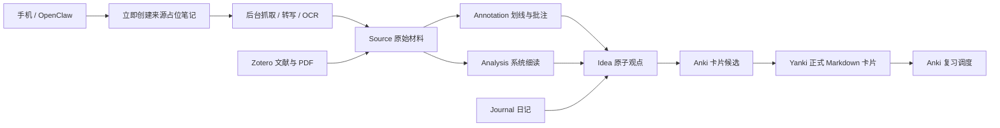

# 个人笔记知识库蓝图

> 蓝图版本：0.1.0  
> 元信息规范版本：1  
> 制定日期：2026-07-25

这是一套面向长期演进的本地个人知识库蓝图。Markdown 是内容的权威载体，Obsidian 是主要编辑界面，Git 管理版本；OpenClaw 负责移动端输入，Zotero 管理学术文献与 PDF，Yanki 将正式卡片单向同步到 Anki。

## 首要原则

1. **文件夹回答“它是什么”**：原始材料、批注、分析、观点、日记、学习材料各有稳定位置。
2. **属性回答“它现在怎样”**：抓取是否完成、是否读过、参与到什么深度，不通过搬动文件表达。
3. **链接回答“它与谁有关”**：来源关系写进属性，思想关系写进正文，主题结构由 MOC 人工整理。
4. **原文与思考分离**：外部原文原则上保持不可变，划线、细读和个人观点另存 Markdown。
5. **一次捕获绝不因抓取失败而丢失**：链接先落盘，内容随后异步获取并可重试。
6. **每个外部系统只有一项职责**：Zotero 管文献，Anki 管复习调度，Obsidian 管思考，Git 管历史。

## 交付内容

- [BLUEPRINT.md](BLUEPRINT.md)：完整信息架构、对象关系和生命周期。
- [DECISIONS.md](DECISIONS.md)：已确定的关键架构决策及其理由。
- [ROADMAP.md](ROADMAP.md)：从最小可用版演进到自动化版的路线。
- [specifications](specifications/)：字段、命名、抓取、阅读、PDF、Anki 和 Git 规范。
- [examples](examples/)：九类可参考的完整笔记示例。
- [vault-starter](vault-starter/)：可直接复制并由 Obsidian 打开的 Starter Vault。

## 五分钟开始使用

1. 将 `vault-starter/` 复制到正式存放位置并用 Obsidian 打开。
2. 在 Obsidian 中启用核心插件：**Properties、Templates、Daily notes、Bases、Backlinks**。
3. 将模板目录设为 `system/templates`。
4. 将 Daily notes 目录设为 `journal/daily`，模板设为 `system/templates/journal-daily.md`。
5. 首页打开 `dashboards/Home.md`。
6. Yanki 只监控 `learning/anki`，不要监控整个 Vault。
7. 在第一次自动化之前，先用模板手工创建少量真实笔记，验证字段和工作流符合习惯。

## 推荐的权威数据流

## 使用边界

- `sources/` 保存外部材料或其索引记录，不直接承载个人长篇思考。
- `notes/` 保存个人参与后的内容。
- `journal/` 与知识笔记同库，允许 AI 访问，但仍保持独立面板。
- 学术 PDF 的权威副本优先放在 Zotero；Vault 保存来源记录、导出批注、细读和提炼观点。
- `learning/english/candidates/` 不受 Yanki 监控；只有准备复习的文件才进入 `learning/anki/`。

## 官方参考

- [Obsidian Properties](https://obsidian.md/help/properties)
- [Obsidian Bases](https://obsidian.md/help/bases)
- [Obsidian Internal links](https://obsidian.md/help/links)
- [Obsidian Web Clipper](https://obsidian.md/clipper)
- [Zotero 基础指南](https://www.zotero.org/support/quick_start_guide)
- [Zotero PDF Reader](https://www.zotero.org/support/pdf_reader)
- [Yanki](https://github.com/kitschpatrol/yanki)
- [Yanki Obsidian Plugin](https://github.com/kitschpatrol/yanki-obsidian)

