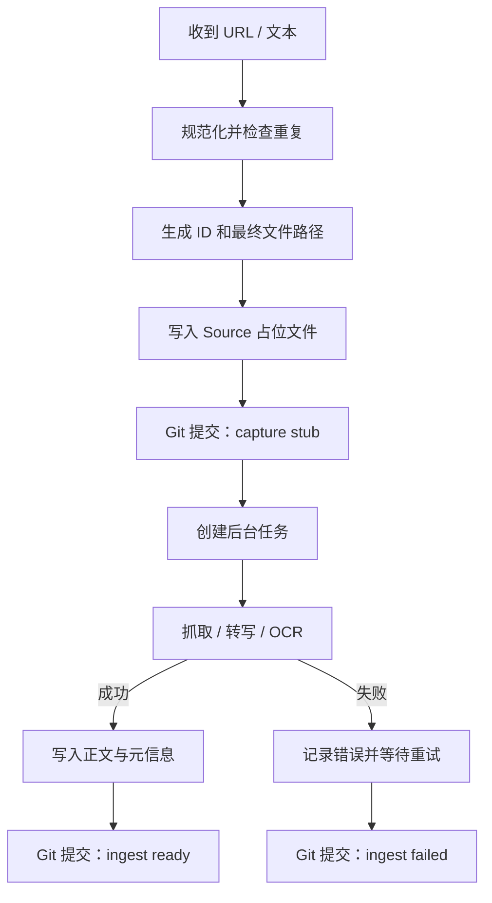

# 捕获与抓取工作流

## 1. 目标

无论网页、音视频、PDF 还是纯文本，捕获操作必须满足：

- 用户输入先可靠落盘。
- 抓取失败不导致链接丢失。
- 同一 URL 不产生无法识别的重复文件。
- 原文与个人评论分离。
- 每次自动化变更可由 Git 审计。

## 2. 捕获事务



占位文件必须在网络请求前写入。

## 3. 推荐输入协议

最短输入：

```text
收：https://example.com
```

推荐输入：

```text
收：https://example.com/article
原因：作者可能给出了反对“知识等于信息”的好论证
主题：知识管理, 学习
优先级：2
```

音视频：

```text
转写：https://video.example/123
原因：需要保留 15 分钟以后关于 spaced repetition 的部分
语言：en
```

纯个人想法不进入 Source：

```text
想法：稍后读系统真正管理的不是文章，而是未来注意力的承诺
主题：知识管理
```

## 4. URL 去重

自动化应：

1. 移除常见跟踪参数。
2. 处理结尾斜杠和默认端口。
3. 尽可能读取 canonical URL。
4. 在已有 Source 的 `canonical_url` 中查重。

发现重复时不静默创建新 Source。可选择：

- 返回现有笔记。
- 将新的 `why_saved` 追加到捕获历史。
- 若网页内容确实是不同版本，显式创建 revision。

## 5. 状态

| 状态 | 含义 |
|---|---|
| `pending` | 已保存输入，等待工作进程 |
| `processing` | 正在抓取、转写或 OCR |
| `ready` | 可供阅读 |
| `failed` | 自动处理失败，可重试 |
| `manual` | 需要登录、验证码、版权限制或人工操作 |

`ingest_status` 与 `read_status` 独立。一篇 `ready` 的文章可以仍是 `unread`。

## 6. 正文写入规则

- `ready` 后的 Source 正文原则上不可手工混入批注。
- 再抓取必须通过显式 refresh。
- refresh 前计算 `content_hash`。
- 内容变化时生成独立 Git 提交，不覆盖无法追踪的历史。
- 页面噪声、导航、推荐列表和评论区应在转换时清理。
- 保留标题、作者、发布时间、URL 和抓取时间。

## 7. Transcript

Transcript 应：

- 标记语言和生成方式。
- 尽可能按说话者和时间戳分段。
- 用可链接标题保存重要时间点。
- 标记是否经过人工校对。

推荐：

```markdown
## 00:13:42 记忆与理解

**Speaker A：** ...
```

增加：

```yaml
transcript_quality: raw_ai   # raw_ai / reviewed / verified
duration_seconds:
```

## 8. AI 对话

完整 AI 对话属于：

```yaml
type: source
medium: ai_conversation
verification: unverified
```

应保存服务、模型、日期和必要的上下文，但不得将密码、令牌和私密密钥写入 Vault。对话中的局部评论进入 Annotation，稳定洞见另建 Idea。

## 9. 失败与重试

- 指数退避或固定时间窗口均可，首版建议限制自动重试次数。
- 登录墙、验证码和付费墙直接设为 `manual`。
- `ingest_error` 只保存简短、无敏感信息的错误。
- 失败任务必须出现在维护面板。
- 用户可以将无价值来源标记为 `read_status: skipped`，而不是无限重试。

## 10. Git 提交建议

```text
capture(source): add queued article <id>
ingest(source): fetch article <id>
ingest(source): mark <id> failed
transcribe(source): add transcript <id>
```

