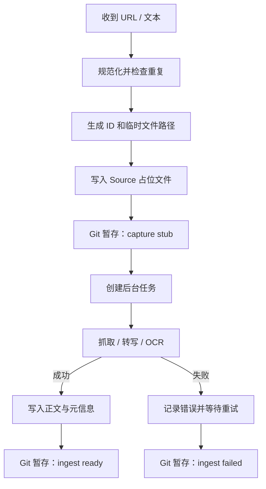

# 捕获与抓取工作流

## 1. 目标

无论网页、音视频、PDF 还是纯文本，捕获操作必须满足：

- 用户输入先可靠落盘。
- 抓取失败不导致链接丢失。
- 同一 URL 不产生无法识别的重复文件。
- 原文与个人评论分离。
- 每次自动化变更可由 Git 审计。
- 来源与用户批注可在同一次输入中到达；批注须在捕获阶段落入该来源唯一的 Annotation 文件。

## 2. 捕获事务



占位文件必须在网络请求前写入。

## 3. 推荐输入协议

最短输入：

```text
收：https://example.com
```

推荐输入：

```text
收：https://example.com/article
主题：知识管理, 学习
优先级：2
```

音视频：

```text
转写：https://video.example/123
语言：en
```

纯个人想法不进入 Source：

```text
想法：稍后读系统真正管理的不是文章，而是未来注意力的承诺
主题：知识管理
```

带批注的捕获：

```text
收：https://example.com/article
主题：知识管理, 学习
优先级：2
批注：
> 稍后读列表管理的不是文章，而是一个人未来愿意投入的注意力。
评论：这解释了为什么收藏不等于理解。
---
> 收藏只降低了未来再次找到信息的成本。
评论：但这可能窄化了“理解”。
```

每条批注单元以 `---` 分隔；以 `>` 开头的行是划线原文，`评论：` 后是用户评论。阅读器导出、聊天转发和截图 OCR 等输入可由 Agent 先归一化为“引文 + 评论 + 可选定位”列表，用户不必严格遵守示例格式。完整规则见 §11。

## 4. URL 去重

自动化应：

1. 移除常见跟踪参数。
2. 处理结尾斜杠和默认端口。
3. 尽可能读取 canonical URL。
4. 在已有 Source 的 `canonical_url` 中查重。

发现重复时不静默创建新 Source。可选择：

- 返回现有笔记。
- 若网页内容确实是不同版本，显式创建 revision。
- 新批注合并到该 Source 已有的 Annotation 文件，而不是新建 Source 或第二个 Annotation 汇总文件。

## 5. 状态

| 状态 | 含义 |
|---|---|
| `pending` | 已保存输入，等待工作进程 |
| `processing` | 正在抓取、转写或 OCR |
| `ready` | 可供阅读 |
| `failed` | 自动处理失败，可重试 |
| `manual` | 需要登录、验证码、版权限制或人工操作 |

`ingest_status` 与 `read_status` 独立。一篇 `ready` 的文章可以仍是 `unread`。

带批注捕获时，Source 的 `engagement` 在捕获阶段即提升为 `highlighted` 或 `annotated`；抓取与阅读状态仍独立演进。

## 6. 正文写入规则

- `ready` 后的 Source 正文原则上不可手工混入批注。
- 再抓取必须通过显式 refresh。
- refresh 前计算 `content_hash`。
- 内容变化时将相关路径加入 Git 暂存区，不自动提交，也不覆盖未暂存的人工修改。
- 页面噪声、导航、推荐列表和评论区应在转换时清理。
- 保留标题层级、段落、引用、列表、表格、代码、强调、链接、正文图片和图注的原始顺序；不得用摘要或连续纯文本替代原文结构。
- 正文图片下载到 `assets/images/<source-id>/`，并改写为标准相对 Markdown 链接。任一有效正文图片失败时不得标记 `ready`。
- 保留标题、作者、发布时间、URL 和抓取时间。
- Annotation 中保存的引文是用户标注时看到的版本，refresh Source 正文时不得回写或覆盖这些引文。
- 网页正文抓取通过仓库自有的确定性 `ingest-web` 命令完成：静态抓取优先，WeChat 站点专用适配，不足时用只读 Playwright 渲染回退；完整读取响应、提取正文与元数据、生成 `vault-image://` token 图片清单，并直接复用原子 `finalize`/`fail` 事务。正文 Markdown 不经过 agent 或 chat 载荷往返。详见 `skills/vault-capture/references/web-runtime.md`。

## 7. Transcript

Transcript 应：

- 标记语言和生成方式。
- 尽可能按说话者和时间戳分段。
- 用可链接标题保存重要时间点。
- 标记是否经过人工校对。

推荐：

```markdown
## 00:13:42 记忆与理解

**Speaker A：** ...
```

增加：

```yaml
transcript_quality: raw_ai   # raw_ai / reviewed / verified
duration_seconds:
```

## 8. AI 对话

完整 AI 对话属于：

```yaml
type: source
medium: ai_conversation
verification: unverified
```

应保存服务、模型、日期和必要的上下文，但不得将密码、令牌和私密密钥写入 Vault。对话中的局部评论进入 Annotation，稳定洞见另建 Idea。

## 9. 失败与重试

- 指数退避或固定时间窗口均可，首版建议限制自动重试次数。
- 登录墙、验证码和付费墙直接设为 `manual`。
- `ingest_error` 只保存简短、无敏感信息的错误。
- 失败任务必须出现在维护面板。
- 用户可以将无价值来源标记为 `read_status: skipped`，而不是无限重试。
- 抓取失败不影响已落盘批注；Annotation 自带引文、评论和 `source_url`，仍可独立阅读与定位。

## 10. Git 暂存与人工提交

捕获自动化只对本次实际变化的路径执行 `git add`，不执行 `git commit` 或 `git push`。Source 占位、Annotation 追加、正文完成和失败状态可以在暂存区持续累积，由用户按主题、时段或维护批次统一提交。

## 11. 伴随批注的捕获

### 11.1 解析与聚合

- 链接与批注可以出现在同一条输入中；每条批注至少包含引文或评论之一。
- 同一 Source 最多对应一个由捕获工作流维护的 Annotation 文件；后续输入继续追加到该文件。
- 对引文和评论执行 Unicode NFKC 归一化并折叠空白。相同 Source 下，归一化后完全相同的引文视为同一引用单元。
- 同一引文和同一评论不重复写入；同一引文出现新评论时追加评论并保留旧评论；不同引文追加为新引用单元。
- 聚合后的 `annotation_kind`：全部为纯引文时取 `highlights`，全部为纯评论时取 `comments`，其他组合取 `mixed`。
- Annotation 或 Source 中只要存在评论，`engagement` 取 `annotated`；只有引文时取 `highlighted`。

### 11.2 原子落盘与 Git 暂存

1. 规范化输入并完成 Source 去重。
2. 原子写入新的 Source 占位；未知正式标题时仅使用 `<source-id>.md`。
3. 原子创建或更新该 Source 唯一的 Annotation 文件。
4. 对 Source 与 Annotation 的本次变化路径执行一次 `git add`；无批注时只暂存 Source。
5. 正文抓取在后台独立执行，成功或失败后再次暂存实际变化的 Source、Annotation 和附件路径。

自动化不得执行 `git commit` 或 `git push`。若 `git add` 失败，保留已经落盘的文件并停止启动后台抓取，等待显式修复。暂存区中已有的其他路径必须保持不变。

### 11.3 Annotation 结构

- frontmatter 保留 `source`、`source_id`、`source_title`、`source_url`、`annotation_kind`、`engagement` 和首次创建时间 `created`。
- 汇总文件不使用单个顶层 `locator` 代表全部批注；定位信息写入每个引用单元。
- 每个引用单元使用 `## 标注 1`、`## 标注 2` 顺序编号，并保存引文和零条或多条评论。
- 捕获时间、可选 locator、评论时间和去重键只保存在隐藏管理元数据中；有 locator 时用于 Source 链接锚点，没有时不得显示“未定位”。
- 后续追加不得修改 `created`，也不新增通用 `updated`；文件整体修改历史由 Git 和 `file.mtime` 提供。

推荐正文：

```markdown
# 来源标题——批注

来源：[[来源-id|来源标题]] · [原文](https://example.com/article)

<!-- vault-capture:annotation-rollup -->
<!-- vault-capture:entries:start -->

## 标注 1

> 稍后读列表管理的不是文章，而是一个人未来愿意投入的注意力。

批注：

- 这解释了为什么收藏不等于理解。
<!-- vault-capture:entries:end -->
```

- 汇总正文在 H1 下方恰好呈现一行 `来源：... · [原文](...)`，不渲染 `## 摘录与批注`，也不在每个编号单元内重复来源行。
- 只有该单元实际包含用户批注时才呈现 `批注：` 及其列表；纯评论单元仍用 `批注：`，全文不出现面向用户的 `评论：`。

### 11.4 重复捕获

- 命中已有 Source 时不创建新 Source；只合并新增批注或其他受支持的结构化信息。
- 若该 Source 尚无 Annotation，则首次创建；若已有，则按 §11.1 合并。
- 重复输入没有产生任何新引文、评论或其他受支持变更时返回现有记录，`staged_paths` 为空。
- Annotation 文件使用首次创建时生成的永久 ID 和稳定文件名，后续捕获不重命名。

### 11.5 失败边界

- Source 抓取失败或永久处于 `manual` 时，Annotation 仍保持有效。
- 后来抓取的正文与既有引文不一致时，以 Annotation 内保存的引文为准。
- 纯评论无引文时允许落盘，但必须保留捕获时间和 Source 链接；可在之后补充定位。
- 目标 Source 或 Annotation 存在未暂存人工修改时，自动化必须停止合并并报告冲突，不得覆盖；已暂存的捕获结果允许继续累积。

## 12. 通用 Source 完成契约

网页是首个实现自动完成阶段的 Source，但 Transcript、Document 和 OCR 的未来处理器必须复用同一契约：

- 未知正式标题时只使用 ID 临时文件，不生成“待处理”或来源域名伪标题。
- Transcript 保留说话者、段落、时间戳、章节和原始语言；摘要或整理稿不得替代 transcript。
- Document 保留标题层级、页序、列表、表格、脚注、代码、图片和图注，并稳定链接原始文件。
- OCR 保留页序、段落边界、图片对应关系和未核验状态，不得把识别结果冒充已核验原文。
- 音频、视频、PDF 和原始图片等附件保持可追溯；处理失败不得丢失初始输入。
- 正文、附件、正式命名、Annotation 链接和状态在同一完成事务中更新；不完整时不得标记 `ready`。

v1 的 Transcript、Document 和 OCR 仍只落盘为 `manual`，本节不授权自动转写、解析或 OCR。
