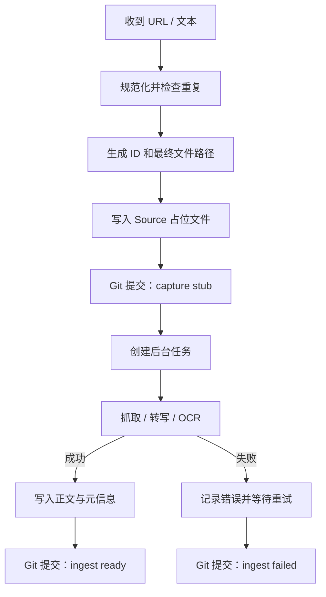

# 捕获与抓取工作流

> 此文件为审阅草稿（proposed）。正式版本仍为 `capture-workflow.md`，未改动。
> 本次变更：新增"伴随批注的捕获"协议（§3 示例 + 新 §11），覆盖手机收藏时把划线/批注一并转给 agent 处理的场景。

## 1. 目标

无论网页、音视频、PDF 还是纯文本，捕获操作必须满足：

- 用户输入先可靠落盘。
- 抓取失败不导致链接丢失。
- 同一 URL 不产生无法识别的重复文件。
- 原文与个人评论分离。
- 每次自动化变更可由 Git 审计。
- 来源与用户批注可在同一次输入中到达；批注须即时转为独立 Annotation 文件，而不是等日后在 Obsidian 里重做。

## 2. 捕获事务



占位文件必须在网络请求前写入。

## 3. 推荐输入协议

最短输入：

```text
收：https://example.com
```

推荐输入：

```text
收：https://example.com/article
原因：作者可能给出了反对"知识等于信息"的好论证
主题：知识管理, 学习
优先级：2
```

音视频：

```text
转写：https://video.example/123
原因：需要保留 15 分钟以后关于 spaced repetition 的部分
语言：en
```

纯个人想法不进入 Source：

```text
想法：稍后读系统真正管理的不是文章，而是未来注意力的承诺
主题：知识管理
```

带批注的捕获（手机收藏时一并转发划线/批注）：

```text
收：https://example.com/article
原因：作者可能给出了反对"知识等于信息"的好论证
主题：知识管理, 学习
优先级：2
批注：
> 稍后读列表管理的不是文章，而是一个人未来愿意投入的注意力。
评论：这解释了为什么 why_saved 比自动摘要更重要。
---
> 收藏只降低了未来再次找到信息的成本。
评论：但这可能窄化了"理解"。
```

每条批注单元以 `---` 分隔；以 `>` 开头的行是划线原文，`评论：` 之后是你的批注。来源应用可以是任意格式（阅读器导出、聊天转发、截图转写），Agent 先归一化为"引文 + 评论"列表再落盘，不要求严格遵守上面的精确格式。完整规则见 §11。

## 4. URL 去重

自动化应：

1. 移除常见跟踪参数。
2. 处理结尾斜杠和默认端口。
3. 尽可能读取 canonical URL。
4. 在已有 Source 的 `canonical_url` 中查重。

发现重复时不静默创建新 Source。可选择：

- 返回现有笔记。
- 将新的 `why_saved` 追加到捕获历史。
- 若网页内容确实是不同版本，显式创建 revision。
- 命中已有 Source 时，新转来的批注挂到该 Source，而非新建来源（见 §11.4）。

## 5. 状态

| 状态 | 含义 |
|---|---|
| `pending` | 已保存输入，等待工作进程 |
| `processing` | 正在抓取、转写或 OCR |
| `ready` | 可供阅读 |
| `failed` | 自动处理失败，可重试 |
| `manual` | 需要登录、验证码、版权限制或人工操作 |

`ingest_status` 与 `read_status` 独立。一篇 `ready` 的文章可以仍是 `unread`。

注意：伴随批注捕获时，Source 的 `engagement` 在捕获阶段即提升到 `highlighted` 或 `annotated`（见 §11.2），但 `ingest_status` 与 `read_status` 仍按本条独立演进。

## 6. 正文写入规则

- `ready` 后的 Source 正文原则上不可手工混入批注。
- 再抓取必须通过显式 refresh。
- refresh 前计算 `content_hash`。
- 内容变化时生成独立 Git 提交，不覆盖无法追踪的历史。
- 页面噪声、导航、推荐列表和评论区应在转换时清理。
- 保留标题、作者、发布时间、URL 和抓取时间。
- 批注文件内保存的引文是用户在手机上看到并标注的版本，refresh 来源正文时**不**回写或覆盖批注引文。

## 7. Transcript

Transcript 应：

- 标记语言和生成方式。
- 尽可能按说话者和时间戳分段。
- 用可链接标题保存重要时间点。
- 标记是否经过人工校对。

推荐：

```markdown
## 00:13:42 记忆与理解

**Speaker A：** ...
```

增加：

```yaml
transcript_quality: raw_ai   # raw_ai / reviewed / verified
duration_seconds:
```

## 8. AI 对话

完整 AI 对话属于：

```yaml
type: source
medium: ai_conversation
verification: unverified
```

应保存服务、模型、日期和必要的上下文，但不得将密码、令牌和私密密钥写入 Vault。对话中的局部评论进入 Annotation，稳定洞见另建 Idea。

## 9. 失败与重试

- 指数退避或固定时间窗口均可，首版建议限制自动重试次数。
- 登录墙、验证码和付费墙直接设为 `manual`。
- `ingest_error` 只保存简短、无敏感信息的错误。
- 失败任务必须出现在维护面板。
- 用户可以将无价值来源标记为 `read_status: skipped`，而不是无限重试。
- 抓取失败不影响已落盘的批注：批注文件自带引文文本，仍可独立阅读与链接（见 §11.5）。

## 10. Git 提交建议

```text
capture(source): add queued article <id>
capture(source+annotations): add <id> with N annotations
ingest(source): fetch article <id>
ingest(source): mark <id> failed
transcribe(source): add transcript <id>
```

## 11. 伴随批注的捕获（Annotation-bearing capture）

当手机收藏或转发文章时，用户可能同时附上在阅读器里做的划线（highlight）与批注（note/comment）。这类输入同时包含"来源"和"用户已产生的参与"，应按以下规则处理。

### 11.1 解析

- 链接与批注可出现在同一条输入中。显式格式以 `批注：` 起头，内部每个批注单元以 `---` 分隔；以 `>` 开头的行是划线原文，`评论：` 之后是批注。
- 每条批注至少包含划线原文或评论之一，据此设定 `annotation_kind`：
  - 只有引文 → `highlights`
  - 只有评论 → `comments`
  - 引文 + 评论 → `mixed`
- 来源应用不限于上述精确格式：阅读器导出、聊天转发、截图 OCR 都可能出现。Agent 先把它们归一化为"引文 + 评论"列表，再落盘；用户无需严格遵守 §3 的格式。

### 11.2 落盘顺序

1. 先按 §2 创建 Source 占位文件并提交（占位不等待批注解析）。
2. 解析批注，为每条批注在 `notes/annotations/` 创建独立 `type: annotation` 文件。
3. Source 占位与批注文件同属一次 `capture(source+annotations)` 提交；正文抓取单独提交。
4. Source 的 `engagement` 立即提升到 `highlighted`（仅有划线）或 `annotated`（含评论），表示参与已在捕获时发生。

### 11.3 Annotation 字段

每个批注文件使用与元信息规范 §5 一致的结构：

- `source` / `source_id` / `source_title` / `source_url`：指向刚创建的 Source。
- `locator`：能确定就填（小节标题、页码、时间戳）；手机转来的批注常缺精确定位，可留空或填 `unknown`，因为引文本身已随文件保存。
- `annotation_kind`、`engagement` 按 §11.1 取值。
- 正文采用命名与链接规范 §5 的"统一引用单元"：先 `>` 引文，再"来源：[[Source#定位]] · [原文](url)"，再"评论："。

### 11.4 去重与合并

- Source 去重按 §4 进行；若命中已有 Source，批注挂到该 Source 而非新建。
- 批注去重：同一 `source_id` 下，引文文本归一化后高度一致视为重复，不重复创建；可把新评论并入已有批注。
- 批注文件自身用稳定 ID 命名，重捕获不覆盖旧批注。

### 11.5 边界情况

- 抓取失败：批注文件已自带引文文本，仍可独立阅读与链接；来源即使永远 `failed`，批注仍能通过 `source_url` 定位到原始材料。
- 批注引文与后来抓取的原文不一致：以批注文件内保存的引文为准（它是用户在手机上看到并标注的版本），不在 refresh 时覆盖。
- 纯评论无引文：仍可成文件，但缺少定位，建议用户在 Obsidian 中补全 `locator` 或补加反向链接。
- 批注数量很大时仍逐条建文件；若一次捕获产生的批注过多，可在提交信息中标注数量，便于维护面板观察。

### 11.6 Git 提交

```text
capture(source+annotations): add <id> with N annotations
ingest(source): fetch article <id>
```
